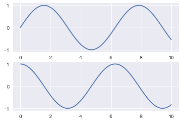
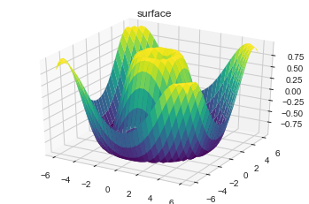
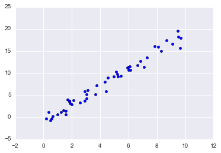
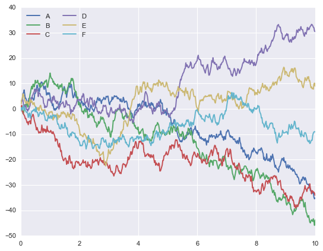
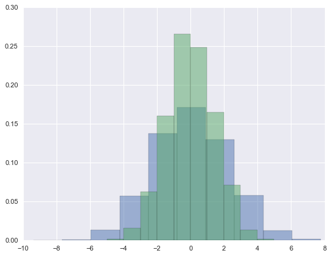

Widely used  | Task oriented
------------- | -------------
[Numpy](#numpy)          | [SymPy](#sympy)
[Matplotlib](#matplotlib)| [Blaze](#blaze)
[Scikit Learn](#sklearn) | [Statsmodels](#statmodel)
[Seaborn](#seaborn)      | [Bokeh](#bokeh)
[Pandas](#pandas)        | [Scrapy](#scrapy)
[SciPy](#scipy)          | [Requests](#request)


> <a id="#numpy">**NumPy**</a>  stands for Numerical Python. The most powerful feature of NumPy is n-dimensional array. This library also contains basic linear algebra functions, Fourier transforms,  advanced random number capabilities and tools for integration with other low level languages like Fortran, C and C++


```python
import numpy as np
np.random.seed(0)  # seed for reproducibility

x1 = np.random.randint(10, size=6)  # One-dimensional array
x2 = np.random.randint(10, size=(3, 4))  # Two-dimensional array
x3 = np.random.randint(10, size=(3, 4, 5))  # Three-dimensional array
print("x3 ndim: ", x3.ndim)
print("x3 shape:", x3.shape)
print("x3 size: ", x3.size)
```

    x3 ndim:  3
    x3 shape: (3, 4, 5)
    x3 size:  60
    


```python
x1
```


    array([5, 0, 3, 3, 7, 9])


```python
x2
```


    array([[3, 5, 2, 4],
           [7, 6, 8, 8],
           [1, 6, 7, 7]])


```python
x2[:2, :3]  # two rows, three columns
```


    array([[3, 5, 2],
           [7, 6, 8]])


```python
x2[:3, ::2]  # all rows, every other column
```


    array([[3, 2],
           [7, 8],
           [1, 7]])


```python
x2[::-1, ::-1] #Finally, subarray dimensions can even be reversed together:
```


    array([[7, 7, 6, 1],
           [8, 8, 6, 7],
           [4, 2, 5, 3]])


```python
grid = np.arange(1, 10).reshape((3, 3))
print(grid) #Reshaping array
```

    [[1 2 3]
     [4 5 6]
     [7 8 9]]
    


```python
####Array Concatenation and Splitting
#Concatenations of arrays
x = np.array([1, 2, 3])
y = np.array([3, 2, 1])
np.concatenate([x, y])
```


    array([1, 2, 3, 3, 2, 1])


```python
#splitting of arrays
x = [1, 2, 3, 99, 99, 3, 2, 1]
x1, x2, x3 = np.split(x, [3, 5])
print(x1, x2, x3)
grid = np.arange(16).reshape((4, 4))
grid


```

    [1 2 3] [99 99] [3 2 1]
    


    array([[ 0,  1,  2,  3],
           [ 4,  5,  6,  7],
           [ 8,  9, 10, 11],
           [12, 13, 14, 15]])


```python
upper, lower = np.vsplit(grid, [2])
print(upper)
print(lower)
```

    [[0 1 2 3]
     [4 5 6 7]]
    [[ 8  9 10 11]
     [12 13 14 15]]
    


```python
left, right = np.hsplit(grid, [2])
print(left)
print(right)
```

    [[ 0  1]
     [ 4  5]
     [ 8  9]
     [12 13]]
    [[ 2  3]
     [ 6  7]
     [10 11]
     [14 15]]
    


```python
#Array Arithmetics 
x = np.arange(4)
print("x     =", x)
print("x + 5 =", x + 5)
print("x - 5 =", x - 5)
print("x * 2 =", x * 2)
print("x / 2 =", x / 2)
print("x // 2 =", x // 2)  # floor division
print("-x     = ", -x)
print("x ** 2 = ", x ** 2)
print("x % 2  = ", x % 2)
print(-(0.5*x + 1) ** 2)
np.add(x, 2)
```

    x     = [0 1 2 3]
    x + 5 = [5 6 7 8]
    x - 5 = [-5 -4 -3 -2]
    x * 2 = [0 2 4 6]
    x / 2 = [0.  0.5 1.  1.5]
    x // 2 = [0 0 1 1]
    -x     =  [ 0 -1 -2 -3]
    x ** 2 =  [0 1 4 9]
    x % 2  =  [0 1 0 1]
    [-1.   -2.25 -4.   -6.25]
    


    array([2, 3, 4, 5])


```python
#trignometry
theta = np.linspace(0, np.pi, 3)
print("theta      = ", theta)
print("sin(theta) = ", np.sin(theta))
print("cos(theta) = ", np.cos(theta))
print("tan(theta) = ", np.tan(theta))
x = [-1, 0, 1]
print("x         = ", x)
print("arcsin(x) = ", np.arcsin(x))
print("arccos(x) = ", np.arccos(x))
print("arctan(x) = ", np.arctan(x))

#Exponents and logarithms
x = [1, 2, 3]
print("x     =", x)
print("e^x   =", np.exp(x))
print("2^x   =", np.exp2(x))
print("3^x   =", np.power(3, x))
x =  [1,  2,  4,  10]
print("x     =", x)
print("ln(x)    =", np.log(x))
print("log2(x)  =", np.log2(x))
print("log10(x) =", np.log10(x))
```

    theta      =  [0.         1.57079633 3.14159265]
    sin(theta) =  [0.0000000e+00 1.0000000e+00 1.2246468e-16]
    cos(theta) =  [ 1.000000e+00  6.123234e-17 -1.000000e+00]
    tan(theta) =  [ 0.00000000e+00  1.63312394e+16 -1.22464680e-16]
    x         =  [-1, 0, 1]
    arcsin(x) =  [-1.57079633  0.          1.57079633]
    arccos(x) =  [3.14159265 1.57079633 0.        ]
    arctan(x) =  [-0.78539816  0.          0.78539816]
    x     = [1, 2, 3]
    e^x   = [ 2.71828183  7.3890561  20.08553692]
    2^x   = [2. 4. 8.]
    3^x   = [ 3  9 27]
    x     = [1, 2, 4, 10]
    ln(x)    = [0.         0.69314718 1.38629436 2.30258509]
    log2(x)  = [0.         1.         2.         3.32192809]
    log10(x) = [0.         0.30103    0.60205999 1.        ]
    

> <a id="#scipy">**SciPy**</a> stands for Scientific Python. SciPy is built on NumPy. It is one of the most useful library for variety of high level science and engineering modules like discrete Fourier transform, Linear Algebra, Optimization and Sparse matrices.


```python
from scipy import special
# Gamma functions (generalized factorials) and related functions
x = [1, 5, 10]
print("gamma(x)     =", special.gamma(x))
print("ln|gamma(x)| =", special.gammaln(x))
print("beta(x, 2)   =", special.beta(x, 2))
# Error function (integral of Gaussian)
# its complement, and its inverse
x = np.array([0, 0.3, 0.7, 1.0])
print("erf(x)  =", special.erf(x))
print("erfc(x) =", special.erfc(x))
print("erfinv(x) =", special.erfinv(x))
```

    gamma(x)     = [1.0000e+00 2.4000e+01 3.6288e+05]
    ln|gamma(x)| = [ 0.          3.17805383 12.80182748]
    beta(x, 2)   = [0.5        0.03333333 0.00909091]
    erf(x)  = [0.         0.32862676 0.67780119 0.84270079]
    erfc(x) = [1.         0.67137324 0.32219881 0.15729921]
    erfinv(x) = [0.         0.27246271 0.73286908        inf]
    

><a id="matplotlib">**Matplotlib** </a>for plotting vast variety of graphs, starting from histograms to line plots to heat plots.. You can use Pylab feature in ipython notebook (ipython notebook –pylab = inline) to use these plotting features inline. If you ignore the inline option, then pylab converts ipython environment to an environment, very similar to Matlab. You can also use Latex commands to add math to your plot.


```python
#Plotting a two-dimensional function
# x and y have 50 steps from 0 to 5
x = np.linspace(0, 5, 50)
y = np.linspace(0, 5, 50)[:, np.newaxis]

z = np.sin(x) ** 10 + np.cos(10 + y * x) * np.cos(x)

%matplotlib inline
import matplotlib.pyplot as plt

plt.imshow(z, origin='lower', extent=[0, 5, 0, 5],
           cmap='viridis')
plt.colorbar();
```


```python
import numpy as np
x = np.linspace(0, 10, 100)

fig = plt.figure()
plt.plot(x, np.sin(x), '-')
plt.plot(x, np.cos(x), '--');
```


```python
plt.figure()  # create a plot figure

# create the first of two panels and set current axis
plt.subplot(2, 1, 1) # (rows, columns, panel number)
plt.plot(x, np.sin(x))

# create the second panel and set current axis
plt.subplot(2, 1, 2)
plt.plot(x, np.cos(x));

```





```python
plt.plot(x, np.sin(x - 0), color='blue')        # specify color by name
plt.plot(x, np.sin(x - 1), color='g')           # short color code (rgbcmyk)
plt.plot(x, np.sin(x - 2), color='0.75')        # Grayscale between 0 and 1
plt.plot(x, np.sin(x - 3), color='#FFDD44')     # Hex code (RRGGBB from 00 to FF)
plt.plot(x, np.sin(x - 4), color=(1.0,0.2,0.3)) # RGB tuple, values 0 to 1
plt.plot(x, np.sin(x - 5), color='chartreuse'); # all HTML color names supported
```


```python
plt.plot(x, x + 0, linestyle='solid')
plt.plot(x, x + 1, linestyle='dashed')
plt.plot(x, x + 2, linestyle='dashdot')
plt.plot(x, x + 3, linestyle='dotted');

# For short, you can use the following codes:
plt.plot(x, x + 4, linestyle='-')  # solid
plt.plot(x, x + 5, linestyle='--') # dashed
plt.plot(x, x + 6, linestyle='-.') # dashdot
plt.plot(x, x + 7, linestyle=':');  # dotted
```


```python
x = np.linspace(0, 10, 30)
y = np.sin(x)

plt.plot(x, y, 'o', color='black');
```


```python
plt.plot(x, y, '-p', color='gray',
         markersize=15, linewidth=4,
         markerfacecolor='white',
         markeredgecolor='gray',
         markeredgewidth=2)
plt.ylim(-1.2, 1.2);
```


```python
#Scatter Plots with plt.scatter
rng = np.random.RandomState(0)
x = rng.randn(100)
y = rng.randn(100)
colors = rng.rand(100)
sizes = 1000 * rng.rand(100)

plt.scatter(x, y, c=colors, s=sizes, alpha=0.3,
            cmap='viridis')
plt.colorbar();  # show color scale
```


### Visualizing Errors


```python
#Basic Errorbars
x = np.linspace(0, 10, 50)
dy = 0.8
y = np.sin(x) + dy * np.random.randn(50)

plt.errorbar(x, y, yerr=dy, fmt='.k');
```


### 3D plotting 


```python
from mpl_toolkits.mplot3d import Axes3D
fig = plt.figure()
ax = plt.axes(projection='3d')

# Data for a three-dimensional line
zline = np.linspace(0, 15, 1000)
xline = np.sin(zline)                 #sin
yline = np.cos(zline)                 #cos
ax.plot3D(xline, yline, zline, 'gray')

# Data for three-dimensional scattered points
zdata = 15 * np.random.random(100)
xdata = np.sin(zdata) + 0.1 * np.random.randn(100)
ydata = np.cos(zdata) + 0.1 * np.random.randn(100)
ax.scatter3D(xdata, ydata, zdata, c=zdata, cmap='Greens');
```


```python
#Three-dimensional Contour Plots

def f(x, y):
    return np.sin(np.sqrt(x ** 2 + y ** 2))

x = np.linspace(-6, 6, 30)
y = np.linspace(-6, 6, 30)

X, Y = np.meshgrid(x, y)
Z = f(X, Y)
fig = plt.figure()
ax = plt.axes(projection='3d')
ax.contour3D(X, Y, Z, 50, cmap='binary')
ax.set_xlabel('x')
ax.set_ylabel('y')
ax.set_zlabel('z');
```


```python
#Wireframes and Surface Plots
fig = plt.figure()
ax = plt.axes(projection='3d')
ax.plot_wireframe(X, Y, Z, color='black')
ax.set_title('wireframe');

```


```python

ax = plt.axes(projection='3d')
ax.plot_surface(X, Y, Z, rstride=1, cstride=1,
                cmap='viridis', edgecolor='none')
ax.set_title('surface');
```





> <a id='pandas'>**Pandas**</a> for structured data operations and manipulations. It is extensively used for data munging and preparation. Pandas were added relatively recently to Python and have been instrumental in boosting Python’s usage in data scientist community.


```python
import pandas as pd
data = pd.read_csv('data/president_heights.csv')
heights = np.array(data['height(cm)'])
print(heights)
print("Mean height:       ", heights.mean())
print("Standard deviation:", heights.std())
print("Minimum height:    ", heights.min())
print("Maximum height:    ", heights.max())
print("25th percentile:   ", np.percentile(heights, 25))
print("Median:            ", np.median(heights))
print("75th percentile:   ", np.percentile(heights, 75))
```

    [189 170 189 163 183 171 185 168 173 183 173 173 175 178 183 193 178 173
     174 183 183 168 170 178 182 180 183 178 182 188 175 179 183 193 182 183
     177 185 188 188 182 185]
    Mean height:        179.73809523809524
    Standard deviation: 6.931843442745892
    Minimum height:     163
    Maximum height:     193
    25th percentile:    174.25
    Median:             182.0
    75th percentile:    183.0
    


```python
%matplotlib inline
import matplotlib.pyplot as plt
import seaborn; seaborn.set()  # set plot style
plt.hist(heights)
plt.title('Height Distribution of US Presidents')
plt.xlabel('height (cm)')
plt.ylabel('number');
```


```python
#The Series-as-dictionary analogy can be made even more clear by constructing a Series object directly from a Python dictionary
population_dict = {'California': 38332521,
                   'Texas': 26448193,
                   'New York': 19651127,
                   'Florida': 19552860,
                   'Illinois': 12882135}
population = pd.Series(population_dict)
population
```


    California    38332521
    Texas         26448193
    New York      19651127
    Florida       19552860
    Illinois      12882135
    dtype: int64


```python
#DataFrame as a generalized NumPy array

area_dict = {'California': 423967, 'Texas': 695662, 'New York': 141297,
             'Florida': 170312, 'Illinois': 149995}
area = pd.Series(area_dict)
area
```


    California    423967
    Texas         695662
    New York      141297
    Florida       170312
    Illinois      149995
    dtype: int64


```python
states = pd.DataFrame({'population': population,
                       'area': area})
states
```


<div>
<style scoped>
    .dataframe tbody tr th:only-of-type {
        vertical-align: middle;
    }

    .dataframe tbody tr th {
        vertical-align: top;
    }

    .dataframe thead th {
        text-align: right;
    }
</style>
<table border="1" class="dataframe">
  <thead>
    <tr style="text-align: right;">
      <th></th>
      <th>population</th>
      <th>area</th>
    </tr>
  </thead>
  <tbody>
    <tr>
      <th>California</th>
      <td>38332521</td>
      <td>423967</td>
    </tr>
    <tr>
      <th>Texas</th>
      <td>26448193</td>
      <td>695662</td>
    </tr>
    <tr>
      <th>New York</th>
      <td>19651127</td>
      <td>141297</td>
    </tr>
    <tr>
      <th>Florida</th>
      <td>19552860</td>
      <td>170312</td>
    </tr>
    <tr>
      <th>Illinois</th>
      <td>12882135</td>
      <td>149995</td>
    </tr>
  </tbody>
</table>
</div>


```python
#Data Selection in DataFrame
area = pd.Series({'California': 423967, 'Texas': 695662,
                  'New York': 141297, 'Florida': 170312,
                  'Illinois': 149995})
pop = pd.Series({'California': 38332521, 'Texas': 26448193,
                 'New York': 19651127, 'Florida': 19552860,
                 'Illinois': 12882135})
data = pd.DataFrame({'area':area, 'pop':pop})
data
```


<div>
<style scoped>
    .dataframe tbody tr th:only-of-type {
        vertical-align: middle;
    }

    .dataframe tbody tr th {
        vertical-align: top;
    }

    .dataframe thead th {
        text-align: right;
    }
</style>
<table border="1" class="dataframe">
  <thead>
    <tr style="text-align: right;">
      <th></th>
      <th>area</th>
      <th>pop</th>
    </tr>
  </thead>
  <tbody>
    <tr>
      <th>California</th>
      <td>423967</td>
      <td>38332521</td>
    </tr>
    <tr>
      <th>Texas</th>
      <td>695662</td>
      <td>26448193</td>
    </tr>
    <tr>
      <th>New York</th>
      <td>141297</td>
      <td>19651127</td>
    </tr>
    <tr>
      <th>Florida</th>
      <td>170312</td>
      <td>19552860</td>
    </tr>
    <tr>
      <th>Illinois</th>
      <td>149995</td>
      <td>12882135</td>
    </tr>
  </tbody>
</table>
</div>


```python
data['density'] = data['pop'] / data['area']
data
```


<div>
<style scoped>
    .dataframe tbody tr th:only-of-type {
        vertical-align: middle;
    }

    .dataframe tbody tr th {
        vertical-align: top;
    }

    .dataframe thead th {
        text-align: right;
    }
</style>
<table border="1" class="dataframe">
  <thead>
    <tr style="text-align: right;">
      <th></th>
      <th>area</th>
      <th>pop</th>
      <th>density</th>
    </tr>
  </thead>
  <tbody>
    <tr>
      <th>California</th>
      <td>423967</td>
      <td>38332521</td>
      <td>90.413926</td>
    </tr>
    <tr>
      <th>Texas</th>
      <td>695662</td>
      <td>26448193</td>
      <td>38.018740</td>
    </tr>
    <tr>
      <th>New York</th>
      <td>141297</td>
      <td>19651127</td>
      <td>139.076746</td>
    </tr>
    <tr>
      <th>Florida</th>
      <td>170312</td>
      <td>19552860</td>
      <td>114.806121</td>
    </tr>
    <tr>
      <th>Illinois</th>
      <td>149995</td>
      <td>12882135</td>
      <td>85.883763</td>
    </tr>
  </tbody>
</table>
</div>


```python
#transpose
data.T
```


<div>
<style scoped>
    .dataframe tbody tr th:only-of-type {
        vertical-align: middle;
    }

    .dataframe tbody tr th {
        vertical-align: top;
    }

    .dataframe thead th {
        text-align: right;
    }
</style>
<table border="1" class="dataframe">
  <thead>
    <tr style="text-align: right;">
      <th></th>
      <th>California</th>
      <th>Texas</th>
      <th>New York</th>
      <th>Florida</th>
      <th>Illinois</th>
    </tr>
  </thead>
  <tbody>
    <tr>
      <th>area</th>
      <td>4.239670e+05</td>
      <td>6.956620e+05</td>
      <td>1.412970e+05</td>
      <td>1.703120e+05</td>
      <td>1.499950e+05</td>
    </tr>
    <tr>
      <th>pop</th>
      <td>3.833252e+07</td>
      <td>2.644819e+07</td>
      <td>1.965113e+07</td>
      <td>1.955286e+07</td>
      <td>1.288214e+07</td>
    </tr>
    <tr>
      <th>density</th>
      <td>9.041393e+01</td>
      <td>3.801874e+01</td>
      <td>1.390767e+02</td>
      <td>1.148061e+02</td>
      <td>8.588376e+01</td>
    </tr>
  </tbody>
</table>
</div>


```python
# Dropping null values

df = pd.DataFrame([[1,      np.nan, 2],
                   [2,      3,      5],
                   [np.nan, 4,      6]])
df
```


<div>
<style scoped>
    .dataframe tbody tr th:only-of-type {
        vertical-align: middle;
    }

    .dataframe tbody tr th {
        vertical-align: top;
    }

    .dataframe thead th {
        text-align: right;
    }
</style>
<table border="1" class="dataframe">
  <thead>
    <tr style="text-align: right;">
      <th></th>
      <th>0</th>
      <th>1</th>
      <th>2</th>
    </tr>
  </thead>
  <tbody>
    <tr>
      <th>0</th>
      <td>1.0</td>
      <td>NaN</td>
      <td>2</td>
    </tr>
    <tr>
      <th>1</th>
      <td>2.0</td>
      <td>3.0</td>
      <td>5</td>
    </tr>
    <tr>
      <th>2</th>
      <td>NaN</td>
      <td>4.0</td>
      <td>6</td>
    </tr>
  </tbody>
</table>
</div>


```python
df.dropna()
```


<div>
<style scoped>
    .dataframe tbody tr th:only-of-type {
        vertical-align: middle;
    }

    .dataframe tbody tr th {
        vertical-align: top;
    }

    .dataframe thead th {
        text-align: right;
    }
</style>
<table border="1" class="dataframe">
  <thead>
    <tr style="text-align: right;">
      <th></th>
      <th>0</th>
      <th>1</th>
      <th>2</th>
    </tr>
  </thead>
  <tbody>
    <tr>
      <th>1</th>
      <td>2.0</td>
      <td>3.0</td>
      <td>5</td>
    </tr>
  </tbody>
</table>
</div>


```python
df.dropna(axis='columns')
```


<div>
<style scoped>
    .dataframe tbody tr th:only-of-type {
        vertical-align: middle;
    }

    .dataframe tbody tr th {
        vertical-align: top;
    }

    .dataframe thead th {
        text-align: right;
    }
</style>
<table border="1" class="dataframe">
  <thead>
    <tr style="text-align: right;">
      <th></th>
      <th>2</th>
    </tr>
  </thead>
  <tbody>
    <tr>
      <th>0</th>
      <td>2</td>
    </tr>
    <tr>
      <th>1</th>
      <td>5</td>
    </tr>
    <tr>
      <th>2</th>
      <td>6</td>
    </tr>
  </tbody>
</table>
</div>


```python
#Hierarchical Indexing
index = [('California', 2000), ('California', 2010),
         ('New York', 2000), ('New York', 2010),
         ('Texas', 2000), ('Texas', 2010)]
populations = [33871648, 37253956,
               18976457, 19378102,
               20851820, 25145561]
pop = pd.Series(populations, index=index)
pop
```


    (California, 2000)    33871648
    (California, 2010)    37253956
    (New York, 2000)      18976457
    (New York, 2010)      19378102
    (Texas, 2000)         20851820
    (Texas, 2010)         25145561
    dtype: int64


```python
pop[('California', 2010):('Texas', 2000)]
```


    (California, 2010)    37253956
    (New York, 2000)      18976457
    (New York, 2010)      19378102
    (Texas, 2000)         20851820
    dtype: int64


```python
pop[[i for i in pop.index if i[1] == 2010]]
```


    (California, 2010)    37253956
    (New York, 2010)      19378102
    (Texas, 2010)         25145561
    dtype: int64


```python
#The Better Way: Pandas MultiIndex
index = pd.MultiIndex.from_tuples(index)
index
```


    MultiIndex(levels=[['California', 'New York', 'Texas'], [2000, 2010]],
               labels=[[0, 0, 1, 1, 2, 2], [0, 1, 0, 1, 0, 1]])


```python
class display(object):
    """Display HTML representation of multiple objects"""
    template = """<div style="float: left; padding: 10px;">
    <p style='font-family:"Courier New", Courier, monospace'>{0}</p>{1}
    </div>"""
    def __init__(self, *args):
        self.args = args
        
    def _repr_html_(self):
        return '\n'.join(self.template.format(a, eval(a)._repr_html_())
                         for a in self.args)
    
    def __repr__(self):
        return '\n\n'.join(a + '\n' + repr(eval(a))
                           for a in self.args)
```


```python
#Relational Algebra:
# Joins
# One to one join
df1 = pd.DataFrame({'employee': ['Bob', 'Jake', 'Lisa', 'Sue'],
                    'group': ['Accounting', 'Engineering', 'Engineering', 'HR']})
df2 = pd.DataFrame({'employee': ['Lisa', 'Bob', 'Jake', 'Sue'],
                    'hire_date': [2004, 2008, 2012, 2014]})
display('df1', 'df2','pd.merge(df1, df2)')
```


<div style="float: left; padding: 10px;">
    <p style='font-family:"Courier New", Courier, monospace'>df1</p><div>
<style scoped>
    .dataframe tbody tr th:only-of-type {
        vertical-align: middle;
    }

    .dataframe tbody tr th {
        vertical-align: top;
    }

    .dataframe thead th {
        text-align: right;
    }
</style>
<table border="1" class="dataframe">
  <thead>
    <tr style="text-align: right;">
      <th></th>
      <th>employee</th>
      <th>group</th>
    </tr>
  </thead>
  <tbody>
    <tr>
      <th>0</th>
      <td>Bob</td>
      <td>Accounting</td>
    </tr>
    <tr>
      <th>1</th>
      <td>Jake</td>
      <td>Engineering</td>
    </tr>
    <tr>
      <th>2</th>
      <td>Lisa</td>
      <td>Engineering</td>
    </tr>
    <tr>
      <th>3</th>
      <td>Sue</td>
      <td>HR</td>
    </tr>
  </tbody>
</table>
</div>
    </div>
<div style="float: left; padding: 10px;">
    <p style='font-family:"Courier New", Courier, monospace'>df2</p><div>
<style scoped>
    .dataframe tbody tr th:only-of-type {
        vertical-align: middle;
    }

    .dataframe tbody tr th {
        vertical-align: top;
    }

    .dataframe thead th {
        text-align: right;
    }
</style>
<table border="1" class="dataframe">
  <thead>
    <tr style="text-align: right;">
      <th></th>
      <th>employee</th>
      <th>hire_date</th>
    </tr>
  </thead>
  <tbody>
    <tr>
      <th>0</th>
      <td>Lisa</td>
      <td>2004</td>
    </tr>
    <tr>
      <th>1</th>
      <td>Bob</td>
      <td>2008</td>
    </tr>
    <tr>
      <th>2</th>
      <td>Jake</td>
      <td>2012</td>
    </tr>
    <tr>
      <th>3</th>
      <td>Sue</td>
      <td>2014</td>
    </tr>
  </tbody>
</table>
</div>
    </div>
<div style="float: left; padding: 10px;">
    <p style='font-family:"Courier New", Courier, monospace'>pd.merge(df1, df2)</p><div>
<style scoped>
    .dataframe tbody tr th:only-of-type {
        vertical-align: middle;
    }

    .dataframe tbody tr th {
        vertical-align: top;
    }

    .dataframe thead th {
        text-align: right;
    }
</style>
<table border="1" class="dataframe">
  <thead>
    <tr style="text-align: right;">
      <th></th>
      <th>employee</th>
      <th>group</th>
      <th>hire_date</th>
    </tr>
  </thead>
  <tbody>
    <tr>
      <th>0</th>
      <td>Bob</td>
      <td>Accounting</td>
      <td>2008</td>
    </tr>
    <tr>
      <th>1</th>
      <td>Jake</td>
      <td>Engineering</td>
      <td>2012</td>
    </tr>
    <tr>
      <th>2</th>
      <td>Lisa</td>
      <td>Engineering</td>
      <td>2004</td>
    </tr>
    <tr>
      <th>3</th>
      <td>Sue</td>
      <td>HR</td>
      <td>2014</td>
    </tr>
  </tbody>
</table>
</div>
    </div>


```python
#Many to one join 
df4 = pd.DataFrame({'group': ['Accounting', 'Engineering', 'HR'],
                    'supervisor': ['Carly', 'Guido', 'Steve']})
display('df3', 'df4', 'pd.merge(df3, df4)')
```


<div style="float: left; padding: 10px;">
    <p style='font-family:"Courier New", Courier, monospace'>df3</p><div>
<style scoped>
    .dataframe tbody tr th:only-of-type {
        vertical-align: middle;
    }

    .dataframe tbody tr th {
        vertical-align: top;
    }

    .dataframe thead th {
        text-align: right;
    }
</style>
<table border="1" class="dataframe">
  <thead>
    <tr style="text-align: right;">
      <th></th>
      <th>employee</th>
      <th>group</th>
      <th>hire_date</th>
    </tr>
  </thead>
  <tbody>
    <tr>
      <th>0</th>
      <td>Bob</td>
      <td>Accounting</td>
      <td>2008</td>
    </tr>
    <tr>
      <th>1</th>
      <td>Jake</td>
      <td>Engineering</td>
      <td>2012</td>
    </tr>
    <tr>
      <th>2</th>
      <td>Lisa</td>
      <td>Engineering</td>
      <td>2004</td>
    </tr>
    <tr>
      <th>3</th>
      <td>Sue</td>
      <td>HR</td>
      <td>2014</td>
    </tr>
  </tbody>
</table>
</div>
    </div>
<div style="float: left; padding: 10px;">
    <p style='font-family:"Courier New", Courier, monospace'>df4</p><div>
<style scoped>
    .dataframe tbody tr th:only-of-type {
        vertical-align: middle;
    }

    .dataframe tbody tr th {
        vertical-align: top;
    }

    .dataframe thead th {
        text-align: right;
    }
</style>
<table border="1" class="dataframe">
  <thead>
    <tr style="text-align: right;">
      <th></th>
      <th>group</th>
      <th>supervisor</th>
    </tr>
  </thead>
  <tbody>
    <tr>
      <th>0</th>
      <td>Accounting</td>
      <td>Carly</td>
    </tr>
    <tr>
      <th>1</th>
      <td>Engineering</td>
      <td>Guido</td>
    </tr>
    <tr>
      <th>2</th>
      <td>HR</td>
      <td>Steve</td>
    </tr>
  </tbody>
</table>
</div>
    </div>
<div style="float: left; padding: 10px;">
    <p style='font-family:"Courier New", Courier, monospace'>pd.merge(df3, df4)</p><div>
<style scoped>
    .dataframe tbody tr th:only-of-type {
        vertical-align: middle;
    }

    .dataframe tbody tr th {
        vertical-align: top;
    }

    .dataframe thead th {
        text-align: right;
    }
</style>
<table border="1" class="dataframe">
  <thead>
    <tr style="text-align: right;">
      <th></th>
      <th>employee</th>
      <th>group</th>
      <th>hire_date</th>
      <th>supervisor</th>
    </tr>
  </thead>
  <tbody>
    <tr>
      <th>0</th>
      <td>Bob</td>
      <td>Accounting</td>
      <td>2008</td>
      <td>Carly</td>
    </tr>
    <tr>
      <th>1</th>
      <td>Jake</td>
      <td>Engineering</td>
      <td>2012</td>
      <td>Guido</td>
    </tr>
    <tr>
      <th>2</th>
      <td>Lisa</td>
      <td>Engineering</td>
      <td>2004</td>
      <td>Guido</td>
    </tr>
    <tr>
      <th>3</th>
      <td>Sue</td>
      <td>HR</td>
      <td>2014</td>
      <td>Steve</td>
    </tr>
  </tbody>
</table>
</div>
    </div>


```python
#Many to Many join
df5 = pd.DataFrame({'group': ['Accounting', 'Accounting',
                              'Engineering', 'Engineering', 'HR', 'HR'],
                    'skills': ['math', 'spreadsheets', 'coding', 'linux',
                               'spreadsheets', 'organization']})
display('df1', 'df5', "pd.merge(df1, df5)")
```


<div style="float: left; padding: 10px;">
    <p style='font-family:"Courier New", Courier, monospace'>df1</p><div>
<style scoped>
    .dataframe tbody tr th:only-of-type {
        vertical-align: middle;
    }

    .dataframe tbody tr th {
        vertical-align: top;
    }

    .dataframe thead th {
        text-align: right;
    }
</style>
<table border="1" class="dataframe">
  <thead>
    <tr style="text-align: right;">
      <th></th>
      <th>employee</th>
      <th>group</th>
    </tr>
  </thead>
  <tbody>
    <tr>
      <th>0</th>
      <td>Bob</td>
      <td>Accounting</td>
    </tr>
    <tr>
      <th>1</th>
      <td>Jake</td>
      <td>Engineering</td>
    </tr>
    <tr>
      <th>2</th>
      <td>Lisa</td>
      <td>Engineering</td>
    </tr>
    <tr>
      <th>3</th>
      <td>Sue</td>
      <td>HR</td>
    </tr>
  </tbody>
</table>
</div>
    </div>
<div style="float: left; padding: 10px;">
    <p style='font-family:"Courier New", Courier, monospace'>df5</p><div>
<style scoped>
    .dataframe tbody tr th:only-of-type {
        vertical-align: middle;
    }

    .dataframe tbody tr th {
        vertical-align: top;
    }

    .dataframe thead th {
        text-align: right;
    }
</style>
<table border="1" class="dataframe">
  <thead>
    <tr style="text-align: right;">
      <th></th>
      <th>group</th>
      <th>skills</th>
    </tr>
  </thead>
  <tbody>
    <tr>
      <th>0</th>
      <td>Accounting</td>
      <td>math</td>
    </tr>
    <tr>
      <th>1</th>
      <td>Accounting</td>
      <td>spreadsheets</td>
    </tr>
    <tr>
      <th>2</th>
      <td>Engineering</td>
      <td>coding</td>
    </tr>
    <tr>
      <th>3</th>
      <td>Engineering</td>
      <td>linux</td>
    </tr>
    <tr>
      <th>4</th>
      <td>HR</td>
      <td>spreadsheets</td>
    </tr>
    <tr>
      <th>5</th>
      <td>HR</td>
      <td>organization</td>
    </tr>
  </tbody>
</table>
</div>
    </div>
<div style="float: left; padding: 10px;">
    <p style='font-family:"Courier New", Courier, monospace'>pd.merge(df1, df5)</p><div>
<style scoped>
    .dataframe tbody tr th:only-of-type {
        vertical-align: middle;
    }

    .dataframe tbody tr th {
        vertical-align: top;
    }

    .dataframe thead th {
        text-align: right;
    }
</style>
<table border="1" class="dataframe">
  <thead>
    <tr style="text-align: right;">
      <th></th>
      <th>employee</th>
      <th>group</th>
      <th>skills</th>
    </tr>
  </thead>
  <tbody>
    <tr>
      <th>0</th>
      <td>Bob</td>
      <td>Accounting</td>
      <td>math</td>
    </tr>
    <tr>
      <th>1</th>
      <td>Bob</td>
      <td>Accounting</td>
      <td>spreadsheets</td>
    </tr>
    <tr>
      <th>2</th>
      <td>Jake</td>
      <td>Engineering</td>
      <td>coding</td>
    </tr>
    <tr>
      <th>3</th>
      <td>Jake</td>
      <td>Engineering</td>
      <td>linux</td>
    </tr>
    <tr>
      <th>4</th>
      <td>Lisa</td>
      <td>Engineering</td>
      <td>coding</td>
    </tr>
    <tr>
      <th>5</th>
      <td>Lisa</td>
      <td>Engineering</td>
      <td>linux</td>
    </tr>
    <tr>
      <th>6</th>
      <td>Sue</td>
      <td>HR</td>
      <td>spreadsheets</td>
    </tr>
    <tr>
      <th>7</th>
      <td>Sue</td>
      <td>HR</td>
      <td>organization</td>
    </tr>
  </tbody>
</table>
</div>
    </div>


```python
## US STATE DATA
pop = pd.read_csv('data/state-population.csv')
areas = pd.read_csv('data/state-areas.csv')
abbrevs = pd.read_csv('data/state-abbrevs.csv')

display('pop.head()', 'areas.head()', 'abbrevs.head()')
```


<div style="float: left; padding: 10px;">
    <p style='font-family:"Courier New", Courier, monospace'>pop.head()</p><div>
<style scoped>
    .dataframe tbody tr th:only-of-type {
        vertical-align: middle;
    }

    .dataframe tbody tr th {
        vertical-align: top;
    }

    .dataframe thead th {
        text-align: right;
    }
</style>
<table border="1" class="dataframe">
  <thead>
    <tr style="text-align: right;">
      <th></th>
      <th>state/region</th>
      <th>ages</th>
      <th>year</th>
      <th>population</th>
    </tr>
  </thead>
  <tbody>
    <tr>
      <th>0</th>
      <td>AL</td>
      <td>under18</td>
      <td>2012</td>
      <td>1117489.0</td>
    </tr>
    <tr>
      <th>1</th>
      <td>AL</td>
      <td>total</td>
      <td>2012</td>
      <td>4817528.0</td>
    </tr>
    <tr>
      <th>2</th>
      <td>AL</td>
      <td>under18</td>
      <td>2010</td>
      <td>1130966.0</td>
    </tr>
    <tr>
      <th>3</th>
      <td>AL</td>
      <td>total</td>
      <td>2010</td>
      <td>4785570.0</td>
    </tr>
    <tr>
      <th>4</th>
      <td>AL</td>
      <td>under18</td>
      <td>2011</td>
      <td>1125763.0</td>
    </tr>
  </tbody>
</table>
</div>
    </div>
<div style="float: left; padding: 10px;">
    <p style='font-family:"Courier New", Courier, monospace'>areas.head()</p><div>
<style scoped>
    .dataframe tbody tr th:only-of-type {
        vertical-align: middle;
    }

    .dataframe tbody tr th {
        vertical-align: top;
    }

    .dataframe thead th {
        text-align: right;
    }
</style>
<table border="1" class="dataframe">
  <thead>
    <tr style="text-align: right;">
      <th></th>
      <th>state</th>
      <th>area (sq. mi)</th>
    </tr>
  </thead>
  <tbody>
    <tr>
      <th>0</th>
      <td>Alabama</td>
      <td>52423</td>
    </tr>
    <tr>
      <th>1</th>
      <td>Alaska</td>
      <td>656425</td>
    </tr>
    <tr>
      <th>2</th>
      <td>Arizona</td>
      <td>114006</td>
    </tr>
    <tr>
      <th>3</th>
      <td>Arkansas</td>
      <td>53182</td>
    </tr>
    <tr>
      <th>4</th>
      <td>California</td>
      <td>163707</td>
    </tr>
  </tbody>
</table>
</div>
    </div>
<div style="float: left; padding: 10px;">
    <p style='font-family:"Courier New", Courier, monospace'>abbrevs.head()</p><div>
<style scoped>
    .dataframe tbody tr th:only-of-type {
        vertical-align: middle;
    }

    .dataframe tbody tr th {
        vertical-align: top;
    }

    .dataframe thead th {
        text-align: right;
    }
</style>
<table border="1" class="dataframe">
  <thead>
    <tr style="text-align: right;">
      <th></th>
      <th>state</th>
      <th>abbreviation</th>
    </tr>
  </thead>
  <tbody>
    <tr>
      <th>0</th>
      <td>Alabama</td>
      <td>AL</td>
    </tr>
    <tr>
      <th>1</th>
      <td>Alaska</td>
      <td>AK</td>
    </tr>
    <tr>
      <th>2</th>
      <td>Arizona</td>
      <td>AZ</td>
    </tr>
    <tr>
      <th>3</th>
      <td>Arkansas</td>
      <td>AR</td>
    </tr>
    <tr>
      <th>4</th>
      <td>California</td>
      <td>CA</td>
    </tr>
  </tbody>
</table>
</div>
    </div>


```python
#JOIN 
merged = pd.merge(pop, abbrevs, how='outer',
                  left_on='state/region', right_on='abbreviation')
merged = merged.drop('abbreviation', 1) # drop duplicate info
merged.head()
```


<div>
<style scoped>
    .dataframe tbody tr th:only-of-type {
        vertical-align: middle;
    }

    .dataframe tbody tr th {
        vertical-align: top;
    }

    .dataframe thead th {
        text-align: right;
    }
</style>
<table border="1" class="dataframe">
  <thead>
    <tr style="text-align: right;">
      <th></th>
      <th>state/region</th>
      <th>ages</th>
      <th>year</th>
      <th>population</th>
      <th>state</th>
    </tr>
  </thead>
  <tbody>
    <tr>
      <th>0</th>
      <td>AL</td>
      <td>under18</td>
      <td>2012</td>
      <td>1117489.0</td>
      <td>Alabama</td>
    </tr>
    <tr>
      <th>1</th>
      <td>AL</td>
      <td>total</td>
      <td>2012</td>
      <td>4817528.0</td>
      <td>Alabama</td>
    </tr>
    <tr>
      <th>2</th>
      <td>AL</td>
      <td>under18</td>
      <td>2010</td>
      <td>1130966.0</td>
      <td>Alabama</td>
    </tr>
    <tr>
      <th>3</th>
      <td>AL</td>
      <td>total</td>
      <td>2010</td>
      <td>4785570.0</td>
      <td>Alabama</td>
    </tr>
    <tr>
      <th>4</th>
      <td>AL</td>
      <td>under18</td>
      <td>2011</td>
      <td>1125763.0</td>
      <td>Alabama</td>
    </tr>
  </tbody>
</table>
</div>


```python
merged.isnull().any()
```


    state/region    False
    ages            False
    year            False
    population       True
    state            True
    dtype: bool


><a id="#sklearn">**Scikit Learn**</a>  for machine learning. Built on NumPy, SciPy and matplotlib, this library contains a lot of effiecient tools for machine learning and statistical modeling including classification, regression, clustering and dimensionality reduction.


```python
#Iris data from Scikit-Learn, where each sample is one of three types of flowers that 
#has had the size of its petals and sepals carefully measured
from sklearn.datasets import load_iris
iris = load_iris()
features = iris.data.T

plt.scatter(features[0], features[1], alpha=0.2,
            s=100*features[3], c=iris.target, cmap='viridis')
plt.xlabel(iris.feature_names[0])
plt.ylabel(iris.feature_names[1]);
```


```python
import seaborn as sns
iris = sns.load_dataset('iris')
iris.head()

```


<div>
<style scoped>
    .dataframe tbody tr th:only-of-type {
        vertical-align: middle;
    }

    .dataframe tbody tr th {
        vertical-align: top;
    }

    .dataframe thead th {
        text-align: right;
    }
</style>
<table border="1" class="dataframe">
  <thead>
    <tr style="text-align: right;">
      <th></th>
      <th>sepal_length</th>
      <th>sepal_width</th>
      <th>petal_length</th>
      <th>petal_width</th>
      <th>species</th>
    </tr>
  </thead>
  <tbody>
    <tr>
      <th>0</th>
      <td>5.1</td>
      <td>3.5</td>
      <td>1.4</td>
      <td>0.2</td>
      <td>setosa</td>
    </tr>
    <tr>
      <th>1</th>
      <td>4.9</td>
      <td>3.0</td>
      <td>1.4</td>
      <td>0.2</td>
      <td>setosa</td>
    </tr>
    <tr>
      <th>2</th>
      <td>4.7</td>
      <td>3.2</td>
      <td>1.3</td>
      <td>0.2</td>
      <td>setosa</td>
    </tr>
    <tr>
      <th>3</th>
      <td>4.6</td>
      <td>3.1</td>
      <td>1.5</td>
      <td>0.2</td>
      <td>setosa</td>
    </tr>
    <tr>
      <th>4</th>
      <td>5.0</td>
      <td>3.6</td>
      <td>1.4</td>
      <td>0.2</td>
      <td>setosa</td>
    </tr>
  </tbody>
</table>
</div>


```python
%matplotlib inline
import seaborn as sns; sns.set()
sns.pairplot(iris, hue='species', size=1.5);
```


```python
X_iris = iris.drop('species', axis=1)
X_iris.shape
```


    (150, 4)


```python
y_iris = iris['species']
y_iris.shape
```


    (150,)


### Supervised learning example: Simple linear regression


```python
import matplotlib.pyplot as plt
import numpy as np

rng = np.random.RandomState(42)
x = 10 * rng.rand(50)
y = 2 * x - 1 + rng.randn(50)
plt.scatter(x, y);
```





```python
#choose a model
from sklearn.linear_model import LinearRegression
model = LinearRegression(fit_intercept=True)
## Arrange the data into a features matrix
X = x[:, np.newaxis]
X.shape

```


    (50, 1)


```python
#fit the model to the data
model.fit(X,y)
```


    LinearRegression(copy_X=True, fit_intercept=True, n_jobs=1, normalize=False)


```python
model.coef_, model.intercept_
```


    (array([1.9776566]), -0.9033107255311164)


```python
# predict the unknown data
xfit = np.linspace(-1, 11)
```


```python
Xfit = xfit[:, np.newaxis]
yfit = model.predict(Xfit)
```


```python
#plot the regressio nline
plt.scatter(x, y)
plt.plot(xfit, yfit);
```


### Supervised learning example: Iris classification


```python
from sklearn.cross_validation import train_test_split
Xtrain, Xtest, ytrain, ytest = train_test_split(X_iris, y_iris,
                                                random_state=1)
```


```python
from sklearn.naive_bayes import GaussianNB # 1. choose model class
model = GaussianNB()                       # 2. instantiate model
model.fit(Xtrain, ytrain)                  # 3. fit model to data
y_model = model.predict(Xtest)             # 4. predict on new data
```


```python
from sklearn.metrics import accuracy_score
accuracy_score(ytest, y_model)
```


    0.9736842105263158


### Unsupervised learning example: Iris dimensionality


```python
from sklearn.decomposition import PCA  # 1. Choose the model class
model = PCA(n_components=2)            # 2. Instantiate the model with hyperparameters
model.fit(X_iris)                      # 3. Fit to data. Notice y is not specified!
X_2D = model.transform(X_iris)         # 4. Transform the data to two dimensions
```


```python
iris['PCA1'] = X_2D[:, 0]
iris['PCA2'] = X_2D[:, 1]
sns.lmplot("PCA1", "PCA2", hue='species', data=iris, fit_reg=False);
```


### Unsupervised learning: Iris clustering


```python
from sklearn.mixture import GMM      # 1. Choose the model class
model = GMM(n_components=3,
            covariance_type='full')  # 2. Instantiate the model with hyperparameters
model.fit(X_iris)                    # 3. Fit to data. Notice y is not specified!
y_gmm = model.predict(X_iris)        # 4. Determine cluster labels
```

    C:\Anaconda3\lib\site-packages\sklearn\utils\deprecation.py:58: DeprecationWarning: Class GMM is deprecated; The class GMM is deprecated in 0.18 and will be  removed in 0.20. Use class GaussianMixture instead.
      warnings.warn(msg, category=DeprecationWarning)
    C:\Anaconda3\lib\site-packages\sklearn\utils\deprecation.py:77: DeprecationWarning: Function distribute_covar_matrix_to_match_covariance_type is deprecated; The function distribute_covar_matrix_to_match_covariance_typeis deprecated in 0.18 and will be removed in 0.20.
      warnings.warn(msg, category=DeprecationWarning)
    C:\Anaconda3\lib\site-packages\sklearn\utils\deprecation.py:77: DeprecationWarning: Function log_multivariate_normal_density is deprecated; The function log_multivariate_normal_density is deprecated in 0.18 and will be removed in 0.20.
      warnings.warn(msg, category=DeprecationWarning)
    C:\Anaconda3\lib\site-packages\sklearn\utils\deprecation.py:77: DeprecationWarning: Function log_multivariate_normal_density is deprecated; The function log_multivariate_normal_density is deprecated in 0.18 and will be removed in 0.20.
      warnings.warn(msg, category=DeprecationWarning)
    C:\Anaconda3\lib\site-packages\sklearn\utils\deprecation.py:77: DeprecationWarning: Function log_multivariate_normal_density is deprecated; The function log_multivariate_normal_density is deprecated in 0.18 and will be removed in 0.20.
      warnings.warn(msg, category=DeprecationWarning)
    C:\Anaconda3\lib\site-packages\sklearn\utils\deprecation.py:77: DeprecationWarning: Function log_multivariate_normal_density is deprecated; The function log_multivariate_normal_density is deprecated in 0.18 and will be removed in 0.20.
      warnings.warn(msg, category=DeprecationWarning)
    C:\Anaconda3\lib\site-packages\sklearn\utils\deprecation.py:77: DeprecationWarning: Function log_multivariate_normal_density is deprecated; The function log_multivariate_normal_density is deprecated in 0.18 and will be removed in 0.20.
      warnings.warn(msg, category=DeprecationWarning)
    C:\Anaconda3\lib\site-packages\sklearn\utils\deprecation.py:77: DeprecationWarning: Function log_multivariate_normal_density is deprecated; The function log_multivariate_normal_density is deprecated in 0.18 and will be removed in 0.20.
      warnings.warn(msg, category=DeprecationWarning)
    C:\Anaconda3\lib\site-packages\sklearn\utils\deprecation.py:77: DeprecationWarning: Function log_multivariate_normal_density is deprecated; The function log_multivariate_normal_density is deprecated in 0.18 and will be removed in 0.20.
      warnings.warn(msg, category=DeprecationWarning)
    C:\Anaconda3\lib\site-packages\sklearn\utils\deprecation.py:77: DeprecationWarning: Function log_multivariate_normal_density is deprecated; The function log_multivariate_normal_density is deprecated in 0.18 and will be removed in 0.20.
      warnings.warn(msg, category=DeprecationWarning)
    C:\Anaconda3\lib\site-packages\sklearn\utils\deprecation.py:77: DeprecationWarning: Function log_multivariate_normal_density is deprecated; The function log_multivariate_normal_density is deprecated in 0.18 and will be removed in 0.20.
      warnings.warn(msg, category=DeprecationWarning)
    C:\Anaconda3\lib\site-packages\sklearn\utils\deprecation.py:77: DeprecationWarning: Function log_multivariate_normal_density is deprecated; The function log_multivariate_normal_density is deprecated in 0.18 and will be removed in 0.20.
      warnings.warn(msg, category=DeprecationWarning)
    C:\Anaconda3\lib\site-packages\sklearn\utils\deprecation.py:77: DeprecationWarning: Function log_multivariate_normal_density is deprecated; The function log_multivariate_normal_density is deprecated in 0.18 and will be removed in 0.20.
      warnings.warn(msg, category=DeprecationWarning)
    C:\Anaconda3\lib\site-packages\sklearn\utils\deprecation.py:77: DeprecationWarning: Function log_multivariate_normal_density is deprecated; The function log_multivariate_normal_density is deprecated in 0.18 and will be removed in 0.20.
      warnings.warn(msg, category=DeprecationWarning)
    C:\Anaconda3\lib\site-packages\sklearn\utils\deprecation.py:77: DeprecationWarning: Function log_multivariate_normal_density is deprecated; The function log_multivariate_normal_density is deprecated in 0.18 and will be removed in 0.20.
      warnings.warn(msg, category=DeprecationWarning)
    C:\Anaconda3\lib\site-packages\sklearn\utils\deprecation.py:77: DeprecationWarning: Function log_multivariate_normal_density is deprecated; The function log_multivariate_normal_density is deprecated in 0.18 and will be removed in 0.20.
      warnings.warn(msg, category=DeprecationWarning)
    C:\Anaconda3\lib\site-packages\sklearn\utils\deprecation.py:77: DeprecationWarning: Function log_multivariate_normal_density is deprecated; The function log_multivariate_normal_density is deprecated in 0.18 and will be removed in 0.20.
      warnings.warn(msg, category=DeprecationWarning)
    C:\Anaconda3\lib\site-packages\sklearn\utils\deprecation.py:77: DeprecationWarning: Function log_multivariate_normal_density is deprecated; The function log_multivariate_normal_density is deprecated in 0.18 and will be removed in 0.20.
      warnings.warn(msg, category=DeprecationWarning)
    C:\Anaconda3\lib\site-packages\sklearn\utils\deprecation.py:77: DeprecationWarning: Function log_multivariate_normal_density is deprecated; The function log_multivariate_normal_density is deprecated in 0.18 and will be removed in 0.20.
      warnings.warn(msg, category=DeprecationWarning)
    C:\Anaconda3\lib\site-packages\sklearn\utils\deprecation.py:77: DeprecationWarning: Function log_multivariate_normal_density is deprecated; The function log_multivariate_normal_density is deprecated in 0.18 and will be removed in 0.20.
      warnings.warn(msg, category=DeprecationWarning)
    C:\Anaconda3\lib\site-packages\sklearn\utils\deprecation.py:77: DeprecationWarning: Function log_multivariate_normal_density is deprecated; The function log_multivariate_normal_density is deprecated in 0.18 and will be removed in 0.20.
      warnings.warn(msg, category=DeprecationWarning)
    C:\Anaconda3\lib\site-packages\sklearn\utils\deprecation.py:77: DeprecationWarning: Function log_multivariate_normal_density is deprecated; The function log_multivariate_normal_density is deprecated in 0.18 and will be removed in 0.20.
      warnings.warn(msg, category=DeprecationWarning)
    


```python
iris['cluster'] = y_gmm
sns.lmplot("PCA1", "PCA2", data=iris, hue='species',
           col='cluster', fit_reg=False);
```


### Support Vector Machines


```python
from sklearn.datasets.samples_generator import make_blobs
X, y = make_blobs(n_samples=50, centers=2,
                  random_state=0, cluster_std=0.60)
plt.scatter(X[:, 0], X[:, 1], c=y, s=50, cmap='autumn');
```


```python
xfit = np.linspace(-1, 3.5)
plt.scatter(X[:, 0], X[:, 1], c=y, s=50, cmap='autumn')
plt.plot([0.6], [2.1], 'x', color='red', markeredgewidth=2, markersize=10)

for m, b in [(1, 0.65), (0.5, 1.6), (-0.2, 2.9)]:
    plt.plot(xfit, m * xfit + b, '-k')

plt.xlim(-1, 3.5);
```


```python
#Support Vector Machines: Maximizing the Margin
xfit = np.linspace(-1, 3.5)
plt.scatter(X[:, 0], X[:, 1], c=y, s=50, cmap='autumn')

for m, b, d in [(1, 0.65, 0.33), (0.5, 1.6, 0.55), (-0.2, 2.9, 0.2)]:
    yfit = m * xfit + b
    plt.plot(xfit, yfit, '-k')
    plt.fill_between(xfit, yfit - d, yfit + d, edgecolor='none',
                     color='#AAAAAA', alpha=0.4)

plt.xlim(-1, 3.5);
```


### Decision Tree


```python
from sklearn.datasets import make_blobs

X, y = make_blobs(n_samples=300, centers=4,
                  random_state=0, cluster_std=1.0)
plt.scatter(X[:, 0], X[:, 1], c=y, s=50, cmap='rainbow');
```


```python
from sklearn.tree import DecisionTreeClassifier
tree = DecisionTreeClassifier().fit(X, y)
```


```python
def visualize_classifier(model, X, y, ax=None, cmap='rainbow'):
    ax = ax or plt.gca()
    
    # Plot the training points
    ax.scatter(X[:, 0], X[:, 1], c=y, s=30, cmap=cmap,
               clim=(y.min(), y.max()), zorder=3)
    ax.axis('tight')
    ax.axis('off')
    xlim = ax.get_xlim()
    ylim = ax.get_ylim()
    
    # fit the estimator
    model.fit(X, y)
    xx, yy = np.meshgrid(np.linspace(*xlim, num=200),
                         np.linspace(*ylim, num=200))
    Z = model.predict(np.c_[xx.ravel(), yy.ravel()]).reshape(xx.shape)

    # Create a color plot with the results
    n_classes = len(np.unique(y))
    contours = ax.contourf(xx, yy, Z, alpha=0.3,
                           levels=np.arange(n_classes + 1) - 0.5,
                           cmap=cmap, clim=(y.min(), y.max()),
                           zorder=1)

    ax.set(xlim=xlim, ylim=ylim)
```


```python
visualize_classifier(DecisionTreeClassifier(), X, y)
```

    C:\Anaconda3\lib\site-packages\matplotlib\contour.py:960: UserWarning: The following kwargs were not used by contour: 'clim'
      s)
    


><a id="statmodel">**Statsmodels**</a> for statistical modeling. Statsmodels is a Python module that allows users to explore data, estimate statistical models, and perform statistical tests. An extensive list of descriptive statistics, statistical tests, plotting functions, and result statistics are available for different types of data and each estimator.


><a id="seaborn">**Seaborn**</a> for statistical data visualization. Seaborn is a library for making attractive and informative statistical graphics in Python. It is based on matplotlib. Seaborn aims to make visualization a central part of exploring and understanding data.


```python
plt.style.use('classic')
# Create some data
rng = np.random.RandomState(0)
x = np.linspace(0, 10, 500)
y = np.cumsum(rng.randn(500, 6), 0)
# Plot the data with Matplotlib defaults
plt.plot(x, y)
plt.legend('ABCDEF', ncol=2, loc='upper left');
```


```python
import seaborn as sns
sns.set()
# same plotting code as above!
plt.plot(x, y)
plt.legend('ABCDEF', ncol=2, loc='upper left');
```





```python
##Histograms, KDE, and densities


data = np.random.multivariate_normal([0, 0], [[5, 2], [2, 2]], size=2000)
data = pd.DataFrame(data, columns=['x', 'y'])

for col in 'xy':
    plt.hist(data[col], normed=True, alpha=0.5)
```

    C:\Anaconda3\lib\site-packages\matplotlib\axes\_axes.py:6462: UserWarning: The 'normed' kwarg is deprecated, and has been replaced by the 'density' kwarg.
      warnings.warn("The 'normed' kwarg is deprecated, and has been "
    C:\Anaconda3\lib\site-packages\matplotlib\axes\_axes.py:6462: UserWarning: The 'normed' kwarg is deprecated, and has been replaced by the 'density' kwarg.
      warnings.warn("The 'normed' kwarg is deprecated, and has been "
    





```python
for col in 'xy':
    sns.kdeplot(data[col], shade=True)
```


```python
#Histograms and KDE can be combined using distplot:
sns.distplot(data['x'])
sns.distplot(data['y']);
```

    C:\Anaconda3\lib\site-packages\matplotlib\axes\_axes.py:6462: UserWarning: The 'normed' kwarg is deprecated, and has been replaced by the 'density' kwarg.
      warnings.warn("The 'normed' kwarg is deprecated, and has been "
    C:\Anaconda3\lib\site-packages\matplotlib\axes\_axes.py:6462: UserWarning: The 'normed' kwarg is deprecated, and has been replaced by the 'density' kwarg.
      warnings.warn("The 'normed' kwarg is deprecated, and has been "
    


```python
sns.kdeplot(data);
```

    C:\Anaconda3\lib\site-packages\seaborn\distributions.py:645: UserWarning: Passing a 2D dataset for a bivariate plot is deprecated in favor of kdeplot(x, y), and it will cause an error in future versions. Please update your code.
      warnings.warn(warn_msg, UserWarning)
    


```python
# Understand the distribution
with  sns.axes_style('white'):
    sns.jointplot("x", "y", data, kind='kde');
```


## Running below two code snippets to generate random point and plots


```python
## k-Nearest Neighbors Clustering

X  = np.random.rand(10, 2)
%matplotlib inline
import matplotlib.pyplot as plt
import seaborn; seaborn.set() # Plot styling
plt.scatter(X[:, 0], X[:, 1], s=100);
```


the distance between each pair of points. Recall that the squared-distance between two points is the sum of the squared differences in each dimension; using the efficient broadcasting (Computation on Arrays: Broadcasting) and aggregation (Aggregations: Min, Max, and Everything In Between) routines provided by NumPy we can compute the matrix of square distances


```python
dist_sq = np.sum((X[:, np.newaxis, :] - X[np.newaxis, :, :]) ** 2, axis=-1)
# for each pair of points, compute differences in their coordinates
differences = X[:, np.newaxis, :] - X[np.newaxis, :, :]
print("differences in shape ",differences.shape)
# square the coordinate differences
sq_differences = differences ** 2
print("square the coordinate difference ",sq_differences.shape)
# sum the coordinate differences to get the squared distance
dist_sq = sq_differences.sum(-1)
print('sum the coordinate differences ',dist_sq.shape)
###
print("diagonal",dist_sq.diagonal())
nearest = np.argsort(dist_sq, axis=1)
print("Nearest:\n",nearest)

K = 2
nearest_partition = np.argpartition(dist_sq, K + 1, axis=1)
plt.scatter(X[:, 0], X[:, 1], s=100)

# draw lines from each point to its two nearest neighbors
K = 2

for i in range(X.shape[0]):
    for j in nearest_partition[i, :K+1]:
        # plot a line from X[i] to X[j]
        # use some zip magic to make it happen:
        plt.plot(*zip(X[j], X[i]), color='black')
#Each point in the plot has lines drawn to its two nearest neighbors.
```

    differences in shape  (10, 10, 2)
    square the coordinate difference  (10, 10, 2)
    sum the coordinate differences  (10, 10)
    diagonal [0. 0. 0. 0. 0. 0. 0. 0. 0. 0.]
    Nearest:
     [[0 5 2 1 8 3 9 6 4 7]
     [1 5 8 2 0 3 9 6 4 7]
     [2 5 1 3 0 9 6 8 7 4]
     [3 9 6 2 1 7 5 8 0 4]
     [4 8 1 7 6 5 3 9 0 2]
     [5 2 1 0 3 8 9 6 7 4]
     [6 9 3 7 8 1 2 5 4 0]
     [7 6 8 3 9 1 4 2 5 0]
     [8 1 4 7 6 5 3 9 2 0]
     [9 3 6 2 7 1 5 8 0 4]]
    


><a id="#bokeh">**Bokeh**</a> for creating interactive plots, dashboards and data applications on modern web-browsers. It empowers the user to generate elegant and concise graphics in the style of D3.js. Moreover, it has the capability of high-performance interactivity over very large or streaming datasets.


><a id="#blaze">**Blaze** </a>for extending the capability of Numpy and Pandas to distributed and streaming datasets. It can be used to access data from a multitude of sources including Bcolz, MongoDB, SQLAlchemy, Apache Spark, PyTables, etc. Together with Bokeh, Blaze can act as a very powerful tool for creating effective visualizations and dashboards on huge chunks of data.


><a id="#scrapy">**Scrapy**</a> for web crawling. It is a very useful framework for getting specific patterns of data. It has the capability to start at a website home url and then dig through web-pages within the website to gather information.


> <a id="#sympy">**SymPy** </a>for symbolic computation. It has wide-ranging capabilities from basic symbolic arithmetic to calculus, algebra, discrete mathematics and quantum physics. Another useful feature is the capability of formatting the result of the computations as LaTeX code.


> <a id="#request">**Requests**</a> for accessing the web. It works similar to the the standard python library urllib2 but is much easier to code. You will find subtle differences with urllib2 but for beginners, Requests might be more convenient.
